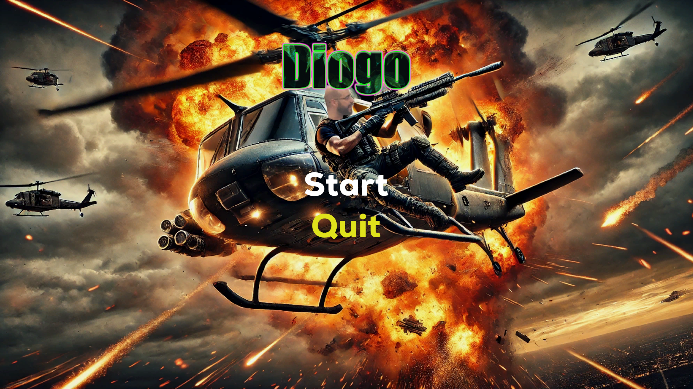
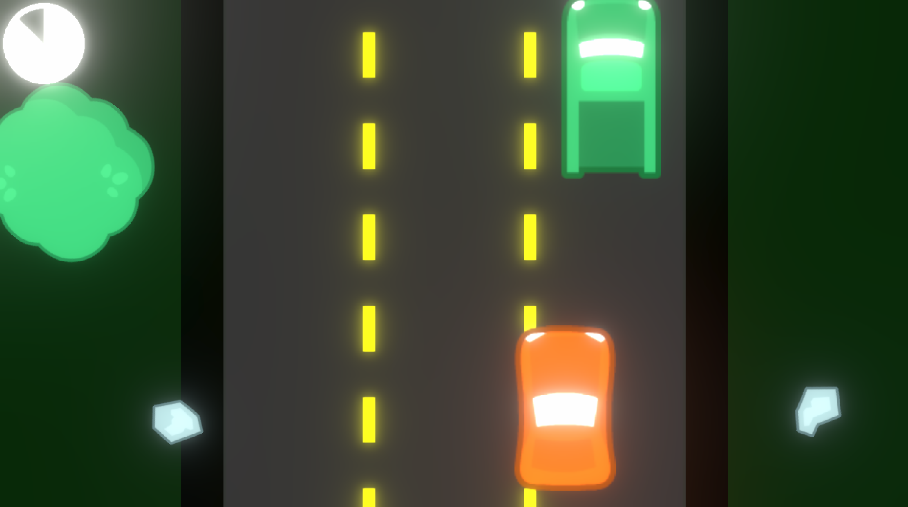
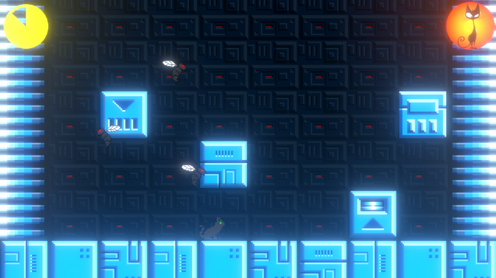
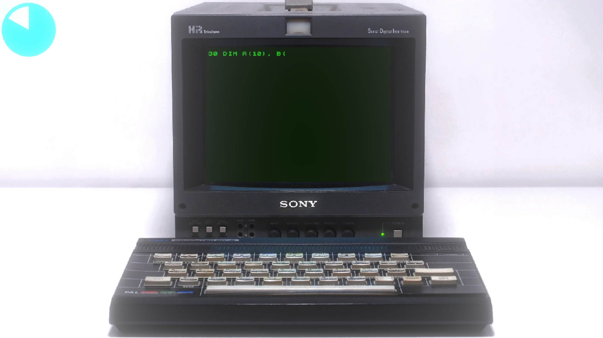
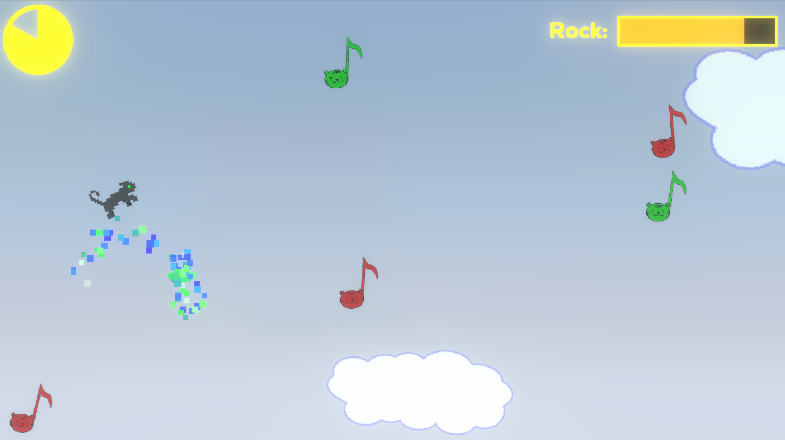
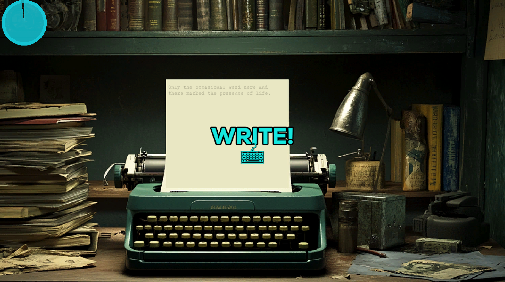
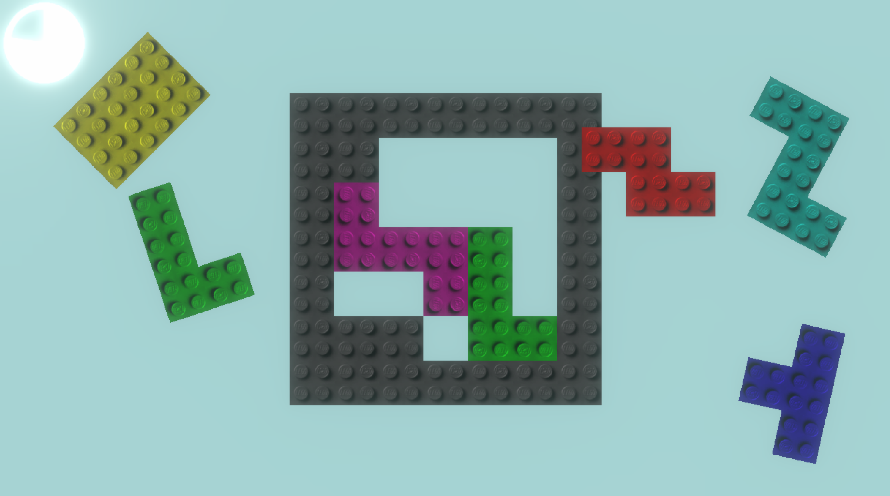
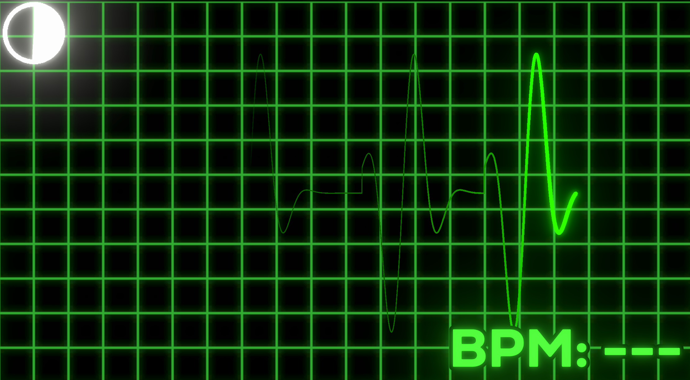

# DIOGO

Developed for the Game Creator's Club at Lusofona University.
This month, the theme is "Self Portrait". And yes, the name of the game is Diogo.

## Game

The game has a series of minigames, connected to a photo. Each represents a facet of my personality and together form my self portrait.
The fact that most facets of my personality are expressed to games shows the overarching theme of my life: games.
Current games are:

- Car Chase: When I was little I wanted to be a ambulance driver

- Cat Game: I'm a cat dad (4 and counting!)

- Coder: Programming is love, programming is life

- Music: I can't be without music, and I used to sing and play the guitar

- Teacher: I'm a teacher and I love it

- Typewriter: I love writing

- Lego: Well, self-explanatory!

Finally, if you fail three times, you get a heart attack (I did in 2023), so you have to play the heart attack minigame to continue playing!

Took me longer than I wanted making this, since it's basically 8 games in one, and even with them being very simple, it always takes a bit to make them, especially the art (yep, even when it's bad!).

## Art

- Beating heart by [Darsycho], licensed through the [CC0] license.
- Blood Lust font by [Font Monger], free for personal use.
- Nexa font by [Font Fabric], free for personal use.
- ZX SPectrum font by [myname5749], free for personal use.
- X Typewriter font by [GGBotNet], licensed under the [SIL Open Font License]
- Racing pack by [Kenney], licensed through the [CC0] license.
- Input prompts pack by [Kenney], licensed through the [CC0] license.
- International Tennis video footage by [Modern ZX-Retro Gaming], licensed under fair use.
- Cat sprites by [Shepardskin], licensed through the [CC0] license.
- Fly sprites by [Croomfolk], licensed through the [OGA-BY 3.0] license.
- Everything else done by [Diogo de Andrade], licensed through the [CC0] license.

## Sound

- Ascending Harp by [ivanmilic], licensed through the [CC0] license.
- Loose sound by [Kastenfrosch], licensed through the [CC0] license.
- Crash sound by [squareal], licensed through the [CC0] license.
- Key click sound by [chris112233], licensed through the [CC0] license.
- Metal loop by [furbyguy], licensed through the [CC0] license.
- Power chord by [mikey_eff], free for personal non-commercial use.
- Dissoance sound by [unfa], licensed through the [CC0] license.
- Coin jump sound by [Jerimee], licensed through the [CC0] license.
- Typewriter key sound by [khwez], licensed through the [CC0] license.
- Typewriter ding sound by [LeonelAle71], licensed through the [CC0] license.
- Eat sound by [vibritherabjit123], licensed through the [CC0] license.
- Lego sound by [rioforce], licensed through the [CC0] license.
- Music is AI generated with [Soundful]
- Everything else done by [Diogo de Andrade], licensed through the [CC0] license.

## Code

- Some code was adapted/refactored from [Okapi Kit], licensed under the [MIT] license.
- All remaining game source code by Diogo de Andrade is licensed under the [MIT] license.

## Metadata

- Autor: [Diogo de Andrade]

[Diogo de Andrade]:https://github.com/DiogoDeAndrade
[CC0]:https://creativecommons.org/publicdomain/zero/1.0/
[CC-BY 3.0]:https://creativecommons.org/licenses/by/3.0/
[CC-BY-SA 4.0]:http://creativecommons.org/licenses/by-sa/4.0/
[MIT]:LICENSE
[Craftpix]:https://craftpix.net
[Okapi Kit]:https://github.com/VideojogosLusofona/OkapiKit
[Darsycho]:https://opengameart.org/users/darsycho
[ivanmilic]:https://freesound.org/people/ivanmilic/
[Kastenfrosch]:https://freesound.org/people/Kastenfrosch/
[Font Monger]:https://www.fontmonger.com
[Font Fabric]:https://www.fontfabric.com/
[Kenney]:https://kenney.nl/
[squareal]:https://freesound.org/people/squareal/
[chris112233]:https://freesound.org/people/chris112233/
[myname5749]:https://www.dafont.com/pt/myname5749.d7037
[Modern ZX-Retro Gaming]:https://www.youtube.com/@MZX-RG
[Shepardskin]:https://opengameart.org/users/shepardskin
[furbyguy]:https://freesound.org/people/furbyguy/
[mikey_eff]:https://freesound.org/people/mikey_eff/
[unfa]:https://freesound.org/people/unfa/
[Jerimee]:https://freesound.org/people/Jerimee/
[khwez]:https://freesound.org/people/khwez/
[LeonelAle71]:https://freesound.org/people/LeonelAle71/
[GGBotNet]:https://www.dafont.com/pt/ggbotnet.d8252
[SIL Open Font License]:LICENSE_SILOFL
[OGA-BY 3.0]:LICENSE_OGA3
[Croomfolk]:https://opengameart.org/users/croomfolk
[vibritherabjit123]:https://freesound.org/people/vibritherabjit123/
[rioforce]:https://freesound.org/people/rioforce/
[Soundful]:https://soundful.com/